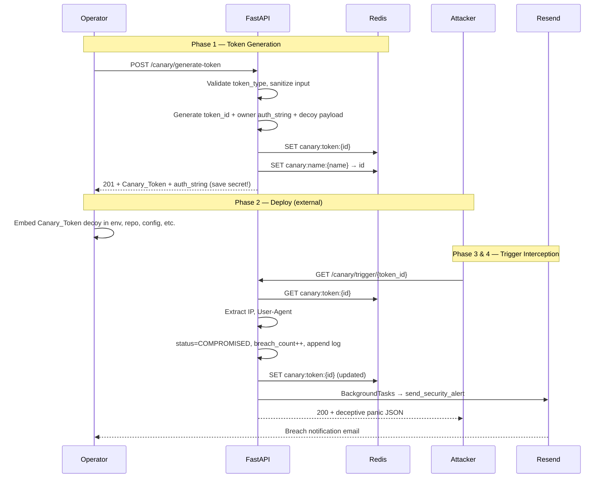

# Sentinel API — System Architecture

Sentinel API (also referred to as **CanaryBox** in project notes) is a lightweight honeypot canary token service. Operators provision decoy credentials or URLs, embed them in real environments, and receive alerts when an unauthorized party interacts with those tripwires.

The system is intentionally small: a single FastAPI application, a Redis datastore, and asynchronous email delivery via Resend. There is no separate worker tier, message queue, or relational database.

---

## High-Level Overview

```text
┌─────────────────┐     HTTP      ┌──────────────────┐     Redis      ┌─────────────┐
│  Client /       │ ────────────► │  FastAPI App     │ ◄────────────► │  Redis      │
│  Attacker       │               │  (main.py)       │                │  (state)    │
└─────────────────┘               └────────┬─────────┘                └─────────────┘
                                           │
                                           │ BackgroundTasks
                                           ▼
                                  ┌──────────────────┐
                                  │  Resend API      │
                                  │  (email alerts)  │
                                  └──────────────────┘
```

| Layer | Responsibility |
|-------|----------------|
| **FastAPI** | HTTP routing, request validation (Pydantic), dependency injection (rate limiter), background task scheduling |
| **Redis** | Token persistence, name-to-ID indexing, per-IP rate limiting |
| **Resend** | Outbound breach notification emails |
| **Pydantic models** | Input schemas (`CanaryTokenCreate`) and stored token shape (`CanaryToken`) |
| **utils/canary_verify** | Per-token ownership checks for fetch and delete routes |

---

## Project Structure

```text
sentinel-api/
├── main.py                      # App entry point; root routes + router registration
├── config.py                    # Redis client + IP rate limiter dependency
├── requirements.txt             # Python dependencies
├── vercel.json                  # Vercel serverless deployment config
├── models/
│   ├── canary_model.py          # Pydantic models for create input and stored tokens
│   └── redis_settings_model.py  # Redis connection and rate-limit settings (env-driven)
├── routes/
│   ├── canary_generation.py     # POST /canary/generate-token
│   ├── canary_fetching.py       # GET  /canary/fetch/id|name/{...}/{auth_string}
│   ├── canary_trigger.py        # GET  /canary/trigger/{token_id}
│   ├── canary_delete.py         # DELETE /canary/delete/id|name/{...}/{auth_string}
│   └── localEmail_testing.md    # Resend sandbox testing notes
├── utils/
│   └── canary_verify.py         # auth_string ownership verification helpers
├── logger_config/
│   └── logs_handler.py          # File + console logging for app, Redis, rate limiter
├── DOCS/                        # Project documentation (this folder)
└── test-fixtures/               # Postman collection, sample payloads, manual test cases
```

Routers are modular: each route file defines an `APIRouter` with `prefix="/canary"` and is mounted in `main.py`. Shared infrastructure (`redis_connect`, `ratelimiter`) lives in `config.py` and is imported by route modules.

---

## Role of FastAPI

FastAPI serves three architectural purposes in this project:

1. **API surface and validation** — Endpoints accept JSON bodies validated against `CanaryTokenCreate`. Invalid payloads are rejected by Pydantic before business logic runs.

2. **Composable middleware via dependencies** — Every route declares `dependencies=[Depends(ratelimiter)]`. The rate limiter runs before the handler and can short-circuit with `429 Too Many Requests`.

3. **Non-blocking alert delivery** — The trigger endpoint uses `BackgroundTasks` to send email alerts after the HTTP response is prepared, so slow or failing email infrastructure does not block the deceptive response to the attacker.

The application is started with Uvicorn (`uvicorn main:app --reload`). FastAPI also exposes auto-generated OpenAPI docs at `/docs` and `/redoc` by default. A custom documentation pointer lives at `GET /canary/docs` (links to the Git repository).

Root and `/canary/docs` support **content negotiation**: clients sending `Accept: text/html` receive styled HTML pages; otherwise JSON is returned.

---

## Role of Redis

Redis is the sole persistence layer. It holds three categories of data:

### 1. Primary token records

- **Key pattern:** `canary:token:{token_id}`
- **Value:** JSON-serialized `CanaryToken` document

Stored fields include `token_ID`, `token_type`, `name`, `alert_email`, `auth_string` (owner secret), `CanaryToken` (deployable decoy), `status`, `breach_count`, `logs`, and timestamps.

### 2. Secondary name index

- **Key pattern:** `canary:name:{normalized_name}` where spaces become underscores and the name is lowercased
- **Value:** The token UUID string
- **Purpose:** O(1) lookup by human-readable name for fetch and delete operations without scanning all tokens

### 3. Rate-limit counters

- **Key pattern:** `rate_limit:{client_ip}`
- **Value:** Integer request count, with TTL set on first request in a window (`REDIS_WINDOW_SECONDS`, default 60s)
- **Purpose:** Enforce `REDIS_MAX_REQUESTS` (default 5) per IP per window

Redis was chosen because token state is small, ephemeral, and accessed by simple key lookups. No migrations, joins, or complex queries are required. The same Redis instance also backs the rate limiter with atomic `INCR` and `EXPIRE`.

Connection is established via `redis.from_url(settings.URL)` in `config.py`. Settings are loaded from environment variables through `redis_Settings` in `models/redis_settings_model.py` (prefix `REDIS_`). The primary variable is **`REDIS_URL`** (default `redis://localhost:7001/`).

---

## Token Field Naming

The codebase uses two distinct secret-related fields. This is important when reading Redis documents or API responses:

| Field | Location | Purpose |
|-------|----------|---------|
| `auth_string` | Stored in Redis; returned once at generation | **Owner secret** (UUID). Required as a path parameter on fetch and delete routes. |
| `CanaryToken` | Stored in Redis; returned as `Canary_Token` at generation | **Deployable decoy** — tripwire URL or fake AWS credential block placed in the environment. |

The trigger endpoint is intentionally **unauthenticated** so any party who discovers the decoy can fire the tripwire.

---

## Authentication Model

| Route class | Auth |
|-------------|------|
| `POST /canary/generate-token` | None (open) |
| `GET /canary/trigger/{token_id}` | None (honeypot — must remain open) |
| `GET /`, `GET /canary/docs` | None |
| Fetch / delete routes | Per-token `auth_string` in URL path |

`utils/canary_verify.py` loads the token from Redis and compares the path `auth_string` to the stored owner secret. Mismatch returns `403 Forbidden`. This is path-parameter API-key style auth, not JWT or global middleware.

For a user-facing guide (including the `auth_string` vs `Canary_Token` distinction), see [authentication.md](./authentication.md).

---

## Request Flow: Token Generation → Trigger Interception

The canary lifecycle has four phases: **provision**, **deploy**, **intercept**, and **alert**.



### Phase 1: Token generation

1. Operator sends `POST /canary/generate-token` with `token_type`, `name`, and `alert_email`.
2. `token_type` is stripped and lowercased; allowed values: `http`, `https`, `aws`, `web`, `url` (`web` and `url` behave like HTTP tripwires).
3. A UUID becomes `token_id`; a separate UUID becomes the owner `auth_string`.
4. Depending on type:
   - **http / https / web / url:** decoy (`CanaryToken`) is a tracking URL: `{DOMAIN}/canary/trigger/{token_id}`
   - **aws:** decoy is a fake credential block embedding the token ID
5. A `CanaryToken` document is written to Redis; a name index key is created.
6. The operator receives `Canary_Token` (decoy to deploy) and `auth_string` (secret for management routes). **Store `auth_string` securely** — it is needed for fetch and delete.

### Phase 2: Deployment (outside the API)

The operator places the `Canary_Token` decoy in a `.env` file, password manager export, S3 bucket policy snippet, or similar. This step is not implemented in code but is essential to the threat model.

### Phase 3: Trigger interception

1. An unauthorized client requests `GET /canary/trigger/{token_id}` (e.g., by following the embedded URL).
2. The handler loads the token from Redis. Missing tokens return `404`.
3. Client identity is derived from `X-Forwarded-For` (first hop) or `request.client.host`, plus `User-Agent`.
4. Token state is mutated: `status` → `COMPROMISED`, `breach_count` incremented, a log entry appended.
5. Updated JSON is written back to Redis.

### Phase 4: Alert and deception

1. If `alert_email` is present, `send_security_alert` is queued on `BackgroundTasks`.
2. The HTTP response returns `200 OK` with a humorous, error-shaped JSON body (`status: "panik"`, `code: "SERVER_HAS_LEFT_THE_CHAT"`) so attackers do not realize they tripped a honeypot.
3. The operator receives an HTML email with IP, user agent, and timestamp.

---

## Cross-Cutting Concerns

### Rate limiting

All routes — including `/`, `/canary/docs`, and every `/canary/*` handler — use the shared `ratelimiter` dependency. Limits are per client IP, stored in Redis, and configurable via `REDIS_MAX_REQUESTS` and `REDIS_WINDOW_SECONDS`.

### Logging

`setupLogger()` configures three named loggers (`app`, `app.redis`, `app.rate_limiter`) writing to `app.log`, `redis.log`, `rate_limiter.log`, and the console. On Vercel (`VERCEL` env set), log files are written under `/tmp/`.

### Data model evolution

Stored tokens accumulate breach telemetry (`logs`, `breach_count`, `status`) only after a trigger event. Fetch endpoints return the live Redis document, so post-trigger inspection shows full incident history.

---

## Deployment Considerations

- Set `DOMAIN` to the public base URL in production so generated HTTP tripwire links resolve correctly.
- Set `REDIS_URL` to your Redis instance (e.g., Upstash connection string). The default in code is `redis://localhost:7001/` — override this for local Docker Redis on port `6379`.
- Configure `RESEND_API_KEY` for alert delivery; without it, triggers still update Redis but emails fail (logged as errors). See `routes/localEmail_testing.md` for sandbox recipient restrictions.
- When behind a reverse proxy, ensure `X-Forwarded-For` is set so attacker IP attribution is accurate.
- `vercel.json` configures serverless deployment; background email tasks run in-process within the same invocation.

For endpoint-level detail, see [api-reference.md](./api-reference.md). For local setup, see [setup-guide.md](./setup-guide.md).
